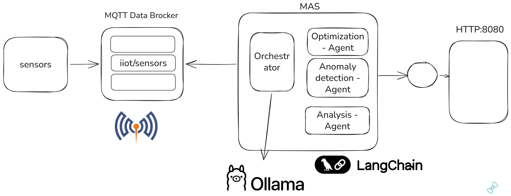

# MAS smart manufacturing
Hybrid Agentic AI and Multi-Agent Systems in Smart Manufacturing

The architecture is structured into five interconnected layers: 
- Intelligence Layer — an LLM Orchestrator Agent (Gemini-2.5-Flash) that reasons over workflow state, selects tools, and adapts strategies via chain-of-thought deliberation; 
- Perception Layer — a Perception Agent that ingests datasets, computes metadata (shape, column types, missing values, summary statistics), and flags data quality issues; 
- Preprocessing Layer — a Preprocessing Agent that performs schema discovery, feature analysis (correlation, mutual information, feature importance), and builds dynamic pipelines (imputation, scaling, encoding) using rule-based tool selection;
- Analytics Layer — an Analysis Agent supporting classification (Random Forest, SVM, Logistic Regression), regression (RF Regressor, Ridge, Lasso, SVR), and anomaly detection (Isolation Forest), with an Adaptive Intelligence module that retries alternative models when performance thresholds (R2 less than 0.1 or accuracy less than 0.6) are not met;
- Optimization Layer — an Optimization Agent that translates model outputs and feature importance scores into ranked, cost-aware, actionable maintenance recommendations with priority scores computed as (predicted_value minus mean) divided by std.

## src

- sensor_simulator.py : publish data on MQTT Broker
- agentic_mas.py : connect to MQTT and call Agentic Fraemwork based on Ollama and local agent (no MCP yet)

## How To

     docker compose build
     docker compose run

then open broser to http://localshot:8080
